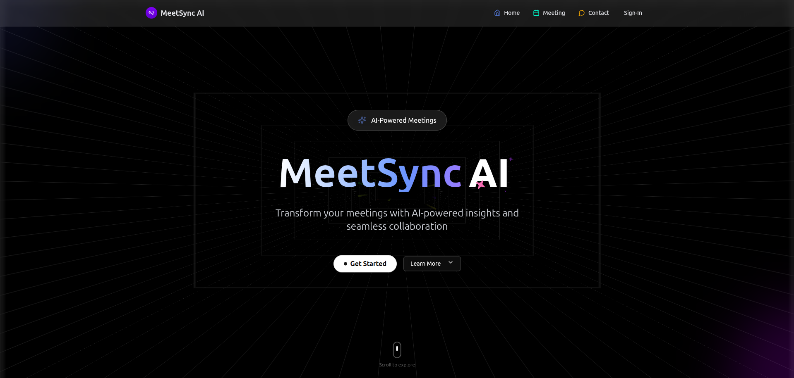

# MeetSync

MeetSync is a comprehensive platform designed to streamline online meetings, making scheduling, coordination, and follow-ups effortless for teams and individuals. This repository hosts the main application code, organized for scalability and maintainability.

---

## 🚀 Table of Contents

- [Project Overview](#project-overview)
- [Features](#features)
- [Technology Stack](#technology-stack)
- [Project Structure](#project-structure)
- [How It Works](#how-it-works)
- [Setup & Installation](#setup--installation)
- [Usage](#usage)
- [Preview](#preview)
- [Contributing](#contributing)
- [License](#license)

---

## 📚 Project Overview

MeetSync aims to simplify the process of organizing and conducting virtual meetings. With integrated scheduling, notifications, and post-meeting summaries, users can focus on collaboration instead of logistics.

---

## ✨ Features

- **User Authentication**: Secure sign-up, login, and OAuth integrations.
- **Meeting Scheduler**: Create, edit, and manage meetings with calendar integration.
- **Real-time Notifications**: Email and in-app reminders for upcoming meetings.
- **Participant Management**: Add, remove, or update attendees.
- **Meeting Notes & Summaries**: Collaborative note-taking and automatic summary generation.
- **Dashboard**: Personalized user dashboard displaying upcoming and past meetings.

---

## 🧰 Technology Stack

MeetSync leverages modern technologies for a robust, scalable, and user-friendly experience.

- **Frontend**: `React.js`, `Redux`, `Tailwind CSS` (or `Material UI`)
- **Backend**: `Node.js`, `Express.js`
- **Database**: `MongoDB` (with `Mongoose`)
- **Authentication**: `JWT`, `OAuth` (Google, Microsoft)
- **Real-time Features**: `Socket.io`
- **Email/Notifications**: `Nodemailer`, third-party integrations
- **Testing**: `Jest`, `Supertest`
- **Deployment**: Docker, CI/CD with GitHub Actions

---

## 📁 Project Structure

```
meetsync/
├── backend/
│   ├── controllers/
│   ├── models/
│   ├── routes/
│   ├── middleware/
│   ├── utils/
│   └── app.js
├── frontend/
│   ├── public/
│   ├── src/
│   │   ├── components/
│   │   ├── pages/
│   │   ├── hooks/
│   │   ├── redux/
│   │   ├── App.js
│   │   └── index.js
├── .env.example
├── docker-compose.yml
├── package.json
└── README.md
```

**Key Folders & Files:**
- `backend/`: Node.js server logic, REST API endpoints, database models, authentication, and utility functions.
- `frontend/`: React-based client app, reusable components, page layouts, state management, and UI styling.
- `.env.example`: Sample environment variables for configuration.
- `docker-compose.yml`: Setup for local development with Docker.
- `package.json`: Project dependencies and scripts.

---

## ⚙️ How It Works

1. **User Authentication:**
   - Users sign up or log in using email/password or OAuth providers.
   - JWT tokens issued for secure API access.
   - Middleware verifies and protects endpoints.

2. **Meeting Scheduling:**
   - Authenticated users can create a new meeting by providing time, participants, and details.
   - Meetings are stored in MongoDB.
   - Calendar view displays upcoming meetings.

3. **Notifications:**
   - Reminders sent via email and/or push notifications using `Nodemailer` and Web Push APIs.
   - Real-time updates for changes using `Socket.io`.

4. **Participant Management:**
   - Add or remove participants from meetings.
   - Role-based permissions for hosts and attendees.

5. **Notes & Summaries:**
   - Collaborative note editor for meetings.
   - Optionally, AI-powered summary generation (integrated with OpenAI or similar APIs).

6. **Dashboard & Analytics:**
   - Personalized dashboard showing meeting metrics, attendance, and notes.

---

## 🖼️ Preview :


---

## 🛠️ Setup & Installation

1. **Clone the repository:**
   ```bash
   git clone https://github.com/iamasit07/meetsync.git
   cd meetsync
   ```

2. **Configure Environment Variables:**
   - Copy `.env.example` to `.env` and fill in the required values.

3. **Install Dependencies:**
   ```bash
   # Backend
   cd backend
   npm install

   # Frontend
   cd ../frontend
   npm install
   ```

4. **Run Locally:**
   ```bash
   # In one terminal
   cd backend
   npm run dev

   # In another terminal
   cd frontend
   npm start
   ```

5. **(Optional) Use Docker:**
   ```bash
   docker-compose up --build
   ```

---

## 💻 Usage

- Visit `http://localhost:3000` in your browser.
- Register or log in.
- Create and manage meetings from your dashboard.
- Invite participants, share notes, and stay organized!

---

## 🤝 Contributing

Contributions are welcome! Please follow these steps:

1. Fork the repository.
2. Create a new branch (`git checkout -b feature-name`).
3. Commit your changes with clear messages.
4. Push to your fork and open a Pull Request.

---

## 📄 License

This project is licensed under the MIT License.

---

## 🙏 Acknowledgements

- Inspired by productivity tools and the need for hassle-free meeting management.
- Thanks to all contributors and open-source maintainers.

---

> _For any queries or support, feel free to open an issue or contact the maintainer!_
